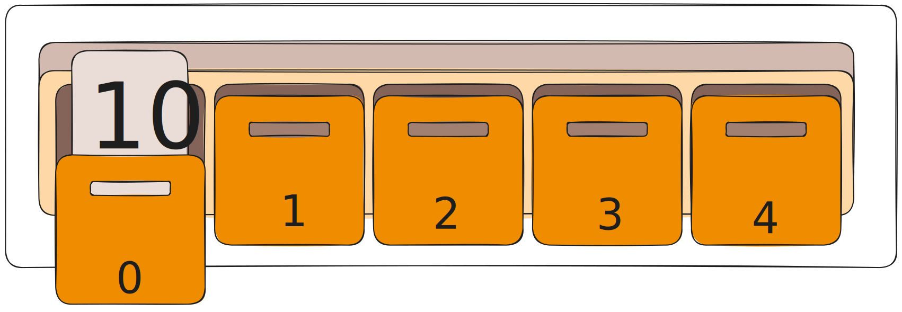
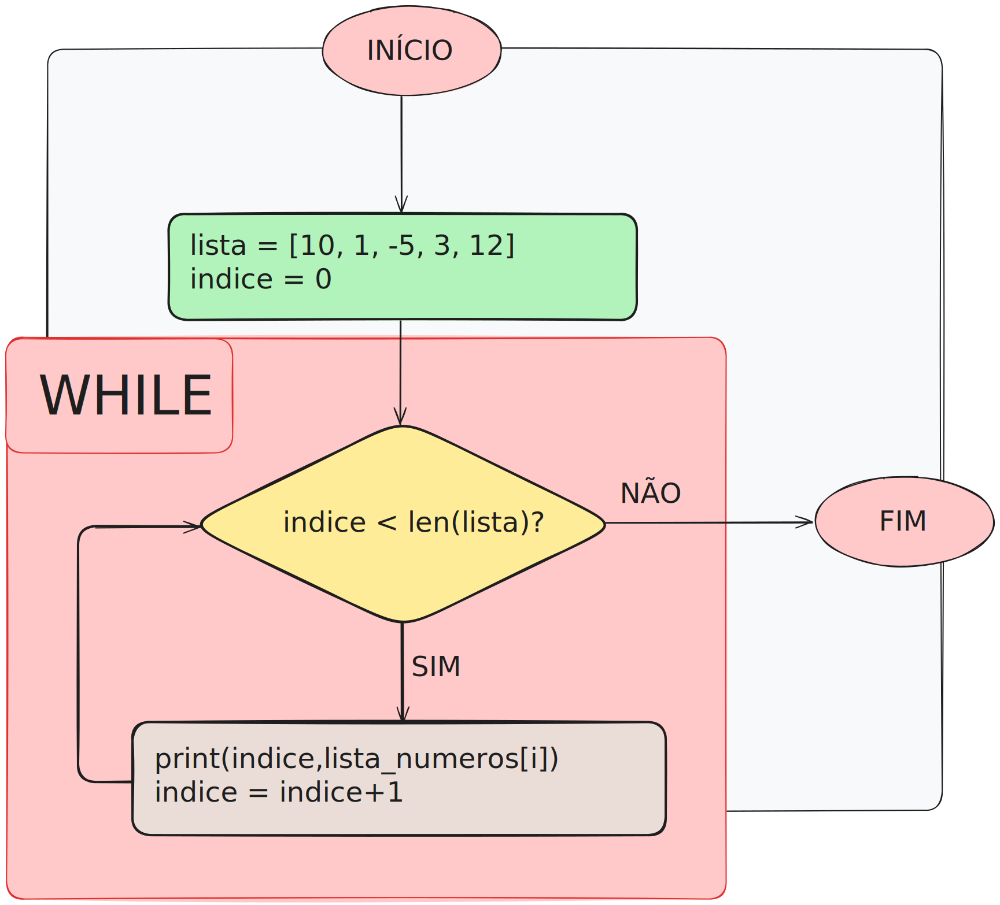

# Introdução a listas

Até agora, sabemos que é possível armazenar valores em variáveis. Isso é extremamente útil e será sempre utilizado, mas não é uma boa escolha para alguns casos. Por exemplo, se quisermos trabalhar com uma grande quantidade de valores, seria preciso fazer operações em cada variável separadamente. Além disso, não há nada que indique de fato que elas estão ligadas umas às outras.

Por isso, é necessário entender uma nova forma de representar dados: a **lista**. O conceito básico é bem parecido com o que conhecemos no cotidiano: assim como podemos criar uma lista de produtos para comprar no supermercado, podemos criar uma lista de valores e armazená-los no computador. 

## Como criar uma lista?

Uma lista, então, é um ***agrupamento de valores ligados a uma mesma variável***. Em *python* é possível fazer a declaração da seguinte forma:

```python
lista_numeros = [10, 1, -5, 3, 12]
``` 

Como analogia, podemos pensar em um armário, que possui várias gavetas. Dentro de cada gaveta, podemos colocar um valor, que tem sua posição conhecida pelo índice (que poderia ser algo como um rótulo da gaveta).
Além disso, se colocamos coisas parecidas nas gavetas, sabemos que é possível tratá-las com a mesma lógica, então nossos dados ficam organizados e podem ser manipulados mais facilmente.



> Em *python*, é possível colocar tipos de dado diferentes em cada posição da lista. Porém, isso prejudica a organização do código, então é algo que deve ser evitado ao máximo. Como dito, se o conteúdo de cada posição tem o mesmo tipo, é mais fácil de programar ações para serem executadas na lista sem que ocorram comportamentos inesperados.

Seguindo essa mesma ideia, é possível declarar listas de qualquer tipo. Por exemplo, com *strings*,

```python
lista_palavras = ["uma", "palavra", "diferente"]
``` 

## Índices

Algo importante e necessário é acessar um elemento específico de uma lista. No primeiro exemplo, como acessaríamos o elemento -5? Para isso, é preciso usar o conceito de `indexação`.

Quando uma lista é criada, cada elemento recebe um `index` (índice) a partir de 0. No primeiro exemplo, teríamos


| ELEMENTO | 10 | 1 | -5 | 3 | 12 | 
| -- | -- | -- | -- | -- | -- |
| INDEX | 0 | 1 | 2 | 3 | 4 | 

Em *python* (e em diversas linguagens de programação), para acessar o valor armazenado em um índice, é possível utilizar a notação `[]` (colchetes) logo após o nome da lista. Portanto, para acessar o elemento -5, basta indicar

```python
lista_numeros[5]
```

É possível escrever, assim, o seguinte código. Nele, a lista é declarada, e o elemento no índice 2 é "*printado*" na tela. 

<kbd>lista.py<kbd>

```python {data-filename = "lista.py"}
lista_numeros = [10, 1, -5, 3, 12]

print(f'O elemento no indice 2 eh {lista_numeros[2]}.')
```
`SAIDA :`
```
O elemento no indice 2 eh -5.
```

## Manipulando elementos

Com a notação `[]`, é possível trabalhar com as posições de uma lista da mesma forma com que tratamos variáveis. Assim, para modificar um valor, basta separá-lo usando o índice e usar a o sinal `=` (atribuição) para definir o valor desejado.

O código abaixo é uma pequena variação do anterior. Ele modifica a posição 2 da lista antes de imprimir o elemento que está nela.

<kbd>lista.py<kbd>

```python {data-filename = "lista.py"}
lista_numeros = [10, 1, -5, 3, 12]

# Operacao de atribuicao
lista_numeros[2] = 11

print(f'O elemento no indice 2 eh {lista_numeros[2]}.')
```
`SAIDA :`
```
O elemento no indice 2 eh 11.
```

## Percorrendo uma lista

Até agora, aprendemos como agrupar valores em uma lista, mas nada até aqui é realmente diferente das operações com variáveis simples. Acessando cada índice manualmente, a manipulação dos dados continua sendo trabalhosa. Por isso, é preciso aprender a **percorrer automaticamente** os elementos das listas.

Como podemos perceber, a ordem dos elementos em uma lista não importa. Portanto, inicialmente, não é possível estabelecer nenhuma relação diretas entre os valores de um elemento e de seu sucessor, por exemplo. Contudo, temos algo com uma ordem muito bem definida: **OS ÍNDICES**. Usaremos eles para caminhar sobre a lista.

Para isso, criamos uma variável auxiliar (aqui, ela será chamada(coincidentemente) de `indice`). Ela será usada em conjunto com a notação `[]`, ou seja, ela indica a posição desejada `lista[indice]` da lista. Como os índices começam em 0, `indice` tamém começará, e, para cada elemento novo que quisermos acessar, basta aumentar o seu valor em 1.

Para a lista numérica usada como exemplo até aqui, teremos algo como
```
indice = 0  --> lista_numeros[0] --> 10
indice = 1  --> lista_numeros[1] --> 1
indice = 2  --> lista_numeros[2] --> -5
indice = 3  --> lista_numeros[3] --> 3
indice = 4  --> lista_numeros[4] --> 12
```

Aqui, ainda existe uma grande dúvida: como aumentar o valor de `indice` para acessar todos os valores? Inicialmente, usaremos uma estrutura presente em diversas linguagens de programação (e que está presente em *python): o **while** (no português, a tradução é **até**).

> ## LOOPS
> A estrutura **while** e a estrutura **for** permitem a criação de LOOPS (repetições). Esse tipo de ferramenta é usado quando é necessário executar alguma ação várias vezes. Para isso, é utilizada uma **condição de parada** (algo que indica que é preciso parar as repetições).
> 
> O **while** repete ações até que uma condição passada para ele tenha valor *False* (falso). É preciso considerar que, se a condição nunca for falsa, o *loop* nunca termina, e o programa não funciona. Logo, é preciso prestar bastante atenção à condição que encerra as repetições. 
> ```python
> while condicao is True:
>     executar()
> ```
>
>Por outro lado, o **for**, em *python*, percorre automaticamente uma lista de elementos, parando exatamente quando ela termina. 
> ```python
> for elemento in lista:
>     executar()
> ```
>
> Aqui, você pode se perguntar: se queremos justamente percorrer uma lista, porque o **while** está sendo mostrado primeiro? A resposta para essa pergunta não é tão simples, mas se resume no fato de que queremos aprender **COMO** uma lista pode ser percorrida, e o **for** esconde a forma como isso é feito.
>
> Portanto, primeiro será apresentado o **while**. Sabendo como ele funciona, fica mais fácil entender o **for**.

Podemos, com ela, escrever o seguinte código:

```python
lista = [10, 1, -5, 3, 12]
indice = 0

while indice < len(lista):
    print(indice, lista[indice])
    indice = indice + 1
```
`SAIDA :`
```
0 10
1 1
2 -5
3 3
4 12
```

> Antes de qualquer coisa, é preciso notar um elemento importante do código: a operação (função) `len()`. Ela retorna (de forma simples, será substituída) pelo tamanho da lista.

Como o índice começa em 0, ele sempre termina em `tamanho da lista - 1`. Estamos sempre aumentando uma unidade no índice, então, quando ele for igual a `tamanho`, nosso **while** será finalizado. Esse comportamento é justamente o mostrado no código acima.

O fluxograma abaixo ilustra o funcionamento do programa. As setas indicam as ações tomadas. No caso do losango, as setas "SIM" e "NÃO" representam a decisão tomada pela estrutura **while** de acordo com a validade da condição que está dentro dele. 

